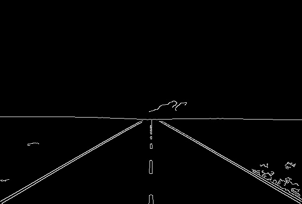
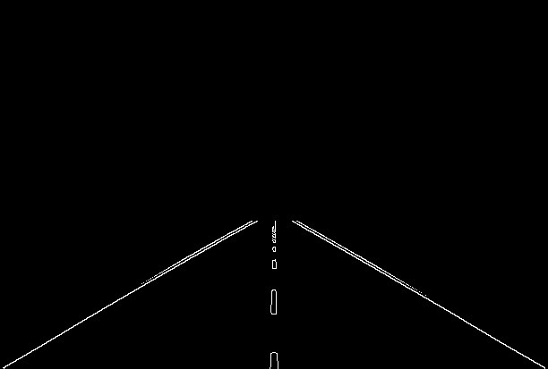
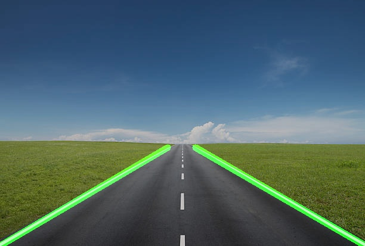

# Road Lane Detection using OpenCV

## Overview

Road Lane Detection is a Computer Vision project that detects lane boundaries in road images using Python and OpenCV.

The system processes an input road image through multiple image processing stages and produces an output image with the detected left and right lane boundaries highlighted.

## Features

- Road lane detection from images
- Grayscale conversion
- Gaussian Blur
- Canny Edge Detection
- Region of Interest masking
- Hough Line Transform
- Left and right lane separation
- Lane visualization
- Intermediate image generation
- Command-line execution

## Technologies Used

- Python
- OpenCV
- NumPy

## Computer Vision Pipeline

Input Road Image
↓
Grayscale Conversion
↓
Gaussian Blur
↓
Canny Edge Detection
↓
Region of Interest
↓
Hough Line Transform
↓
Left/Right Lane Separation
↓
Lane Visualization
↓
Output Image

## Project Structure

```text
Road-lane-detection/
│
├── main.py
├── requirements.txt
├── README.md
├── .gitignore
│
├── input/
│   └── road_image1.jpg
│
└── output/
    ├── grayscale.jpg
    ├── edges.jpg
    ├── roi.jpg
    └── lane_detected.jpg

## Results

### Original Input


### Edge Detection



### Region of Interest



### Final Lane Detection

